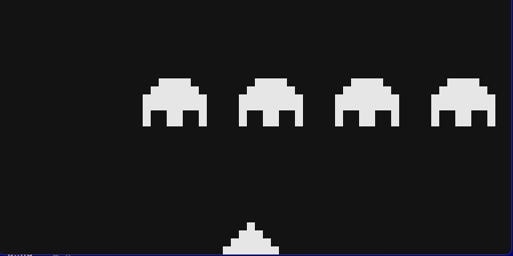

# chip8

A CHIP-8 interpreter in Python with an optional CHIP-48 mode. I wrote it for fun, to see how a CPU works from the inside.

| Tetris | Space Invaders |
| --- | --- |
|  |  |

## What works

- All CHIP-8 instructions. Passes the `corax+` and `flags` test ROMs from [Timendus' test suite](https://github.com/Timendus/chip8-test-suite).
- Runs Tetris, Pong, Brix, Space Invaders and the usual demos.
- `--chip48` switches the shift and jump-with-offset instructions to CHIP-48 behaviour. Space Invaders needs it.
- No sound yet: the sound timer counts down, but nothing beeps.

## Run

Needs Python 3.14 and [uv](https://docs.astral.sh/uv/).

```
uv sync
uv run chip8-window path/to/game.ch8
uv run chip8-window --chip48 path/to/space_invaders.ch8
```

ROMs are not included, they belong to their authors. A good collection: [kripod/chip8-roms](https://github.com/kripod/chip8-roms).

## Keys

The CHIP-8 hex keypad sits on the left side of the keyboard:

```
CHIP-8        keyboard
1 2 3 C       1 2 3 4
4 5 6 D       Q W E R
7 8 9 E       A S D F
A 0 B F       Z X C V
```

## How it works

- `src/chip8/chip8.py` is the machine: 4 KB of memory, 16 registers, a stack, two timers and a 64x32 display. One step fetches two bytes, decodes them into fields and executes the instruction.
- `src/chip8/window.py` is the pygame window. It runs at 60 frames per second, about 11 instructions per frame, ticks the timers once per frame and passes the keyboard state to the machine.

The code is type-checked with `mypy --strict`.
